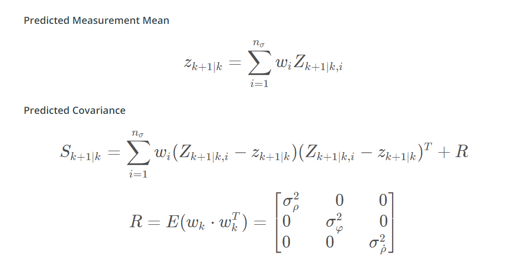

# SFND_Unscented_Kalman_Filter
Sensor Fusion UKF Highway Project Starter Code

In this project you will implement an Unscented Kalman Filter to estimate the state of multiple cars on a highway using noisy lidar and radar measurements. Passing the project requires obtaining RMSE values that are lower that the tolerance outlined in the project rubric. 

The main program can be built and ran by doing the following from the project top directory.

1. mkdir build
2. cd build
3. cmake ..
4. make
5. ./ukf_highway

Note that the programs that need to be written to accomplish the project are src/ukf.cpp, and src/ukf.h

The program main.cpp has already been filled out, but feel free to modify it.

`main.cpp` is using `highway.h` to create a straight 3 lane highway environment with 3 traffic cars and the main ego car at the center. 
The viewer scene is centered around the ego car and the coordinate system is relative to the ego car as well. The ego car is green while the 
other traffic cars are blue. The traffic cars will be accelerating and altering their steering to change lanes. Each of the traffic car's has
it's own UKF object generated for it, and will update each indidual one during every time step. 

The red spheres above cars represent the (x,y) lidar detection and the purple lines show the radar measurements with the velocity magnitude along the detected angle. The Z axis is not taken into account for tracking, so you are only tracking along the X/Y axis.

---

## Other Important Dependencies
* cmake >= 3.5
  * All OSes: [click here for installation instructions](https://cmake.org/install/)
* make >= 4.1 (Linux, Mac), 3.81 (Windows)
  * Linux: make is installed by default on most Linux distros
  * Mac: [install Xcode command line tools to get make](https://developer.apple.com/xcode/features/)
  * Windows: [Click here for installation instructions](http://gnuwin32.sourceforge.net/packages/make.htm)
* gcc/g++ >= 5.4
  * Linux: gcc / g++ is installed by default on most Linux distros
  * Mac: same deal as make - [install Xcode command line tools](https://developer.apple.com/xcode/features/)
  * Windows: recommend using [MinGW](http://www.mingw.org/)
 * PCL 1.2

## Basic Build Instructions

1. Clone this repo.
2. Make a build directory: `mkdir build && cd build`
3. Compile: `cmake .. && make`
4. Run it: `./ukf_highway`

## Editor Settings

We've purposefully kept editor configuration files out of this repo in order to
keep it as simple and environment agnostic as possible. However, we recommend
using the following settings:

* indent using spaces
* set tab width to 2 spaces (keeps the matrices in source code aligned)

## Generating Additional Data

This is optional!

If you'd like to generate your own radar and lidar modify the code in `highway.h` to alter the cars. Also check out `tools.cpp` to
change how measurements are taken, for instance lidar markers could be the (x,y) center of bounding boxes by scanning the PCD environment
and performing clustering. This is similar to what was done in Sensor Fusion Lidar Obstacle Detection.

## Project Introductions
### Proccess Model
The process model of the surrounding cars is constant turn rate and velocity magnitude model (CTRV)

Through the intergal, the X(k+1) can be computed

The process model noise contains 

The Process Model with the noise

Because the process model is noliner (x(K+1) = f(x(k),v(k))), the augmented process model need to implemented, ehich caontains the noise as the state member

### Unscented Kalman Filter
The process model is a non-linear dynamic model, so normal kalman filter is not feasible in this model. While for the extended falman filter, the neglection of the high order terms in taylor expansion and computation of jacobian matrix to linearize non-linear model is expensive in computation and may not represnt the model correctly, so unscented kalman filter is used. The unscented kalman filter contains following steps.

 * Initialize the state X and covariance matrix P

 * Based on X and P to generate Sigma points 

 * Based on the process model, plug in the Sigma Points into process model and generate Xsig(k+1|k)

 * Used the computed Xsig(K+1|K) to predict the predicted expected X(k+1|K) and P(k+1|k).

 * used the predicted X(k+1|k) to compute the estimated measurement Z(K+1|k)

 * After get the new arrived measurements (z(k+1)), and compute the difference, so that the kalman filter gain and covariance matrix Tc can be computed to updated the measurements X(k+1|k+1),
 P(k+1|k+1).

#### Generate Sigma Points

#### Predict Mean and Covariance

#### Predict Measurement 

#### Update Measurement

#### Parameter and Consistency

The process noise need to carefully selected, and the value of noise need to determined by experiments performance.

Normalized Innovation Squared(NIS) is a useful tool to evaluate the noise selection and performance of kalman filter

#### with only Lidar data

##### Only Lidar sensor
Because the lidar sensor can't directly measure the velocity, so the RMSE for the velocity in both x and y are large at the beginning, it will take relative long time for the unscented kalman filter to converge the estimation of velocity to the groud truth. As the time increase, the RMSE continuously drop and reach below the threshold.

##### Only Radar sensor

Radar sensor can directly measure the velocity, the RMSE for the velocity in x and y direction is relative small at the beginning. One sensor data can't efficiently and quickly help the unscented kalman filter converge the estimated value to the ground truth. 

##### Fuse Lidar and Radar data

Good Performance!

